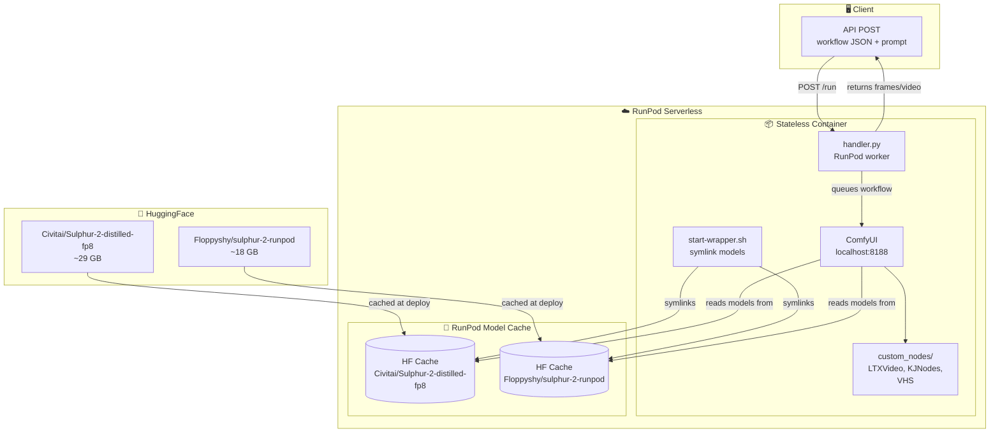
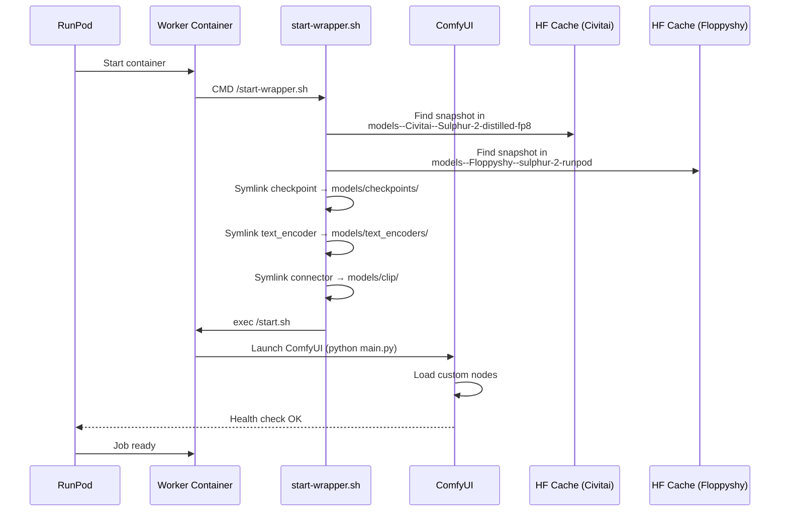
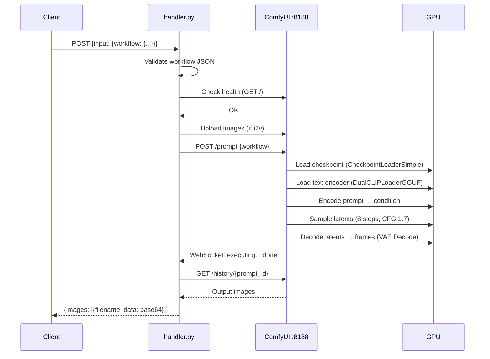
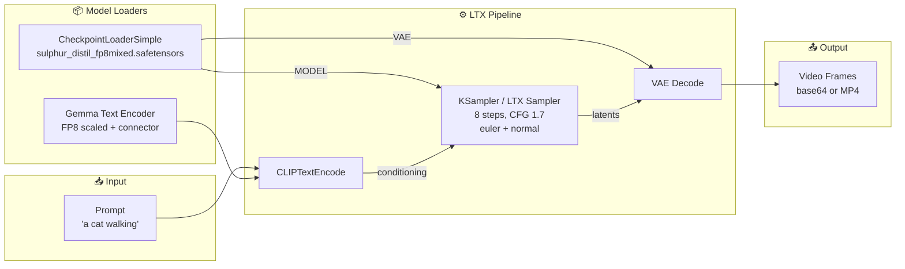
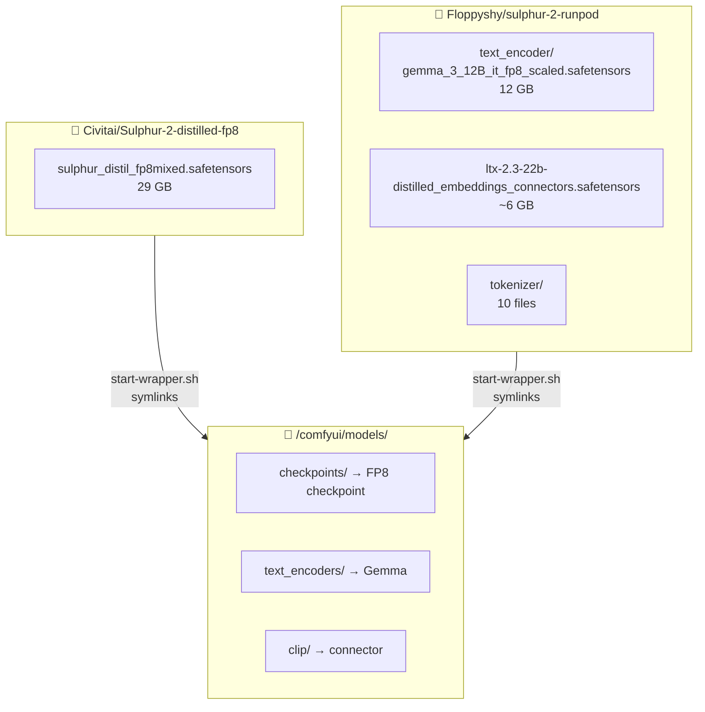

# Sulphur-2 ComfyUI + FP8 — Architecture & Workflow

## System Architecture

```mermaid
flowchart TB
    subgraph Client["🖥️ Client"]
        A[API POST<br/>workflow JSON + prompt]
    end

    subgraph RunPod["☁️ RunPod Serverless"]
        subgraph Container["📦 Stateless Container"]
            B[handler.py<br/>RunPod worker]
            C[start-wrapper.sh<br/>symlink models]
            D[ComfyUI<br/>localhost:8188]
            E[custom_nodes/<br/>LTXVideo, KJNodes,<br/>VHS]
        end

        subgraph Cache["💾 RunPod Model Cache"]
            F1[(HF Cache<br/>Civitai/Sulphur-2-distilled-fp8)]
            F2[(HF Cache<br/>Floppyshy/sulphur-2-runpod)]
        end
    end

    subgraph HF["🤗 HuggingFace"]
        G1[Civitai/Sulphur-2-distilled-fp8<br/>~29 GB]
        G2[Floppyshy/sulphur-2-runpod<br/>~18 GB]
    end

    A -->|"POST /run"| B
    C -->|symlinks| F1
    C -->|symlinks| F2
    B -->|"queues workflow"| D
    D --> E
    D -->|reads models from| F1
    D -->|reads models from| F2
    G1 -->|"cached at deploy"| F1
    G2 -->|"cached at deploy"| F2
    B -->|"returns frames/video"| A
```

## Cold Start Sequence

```mermaid
sequenceDiagram
    participant R as RunPod
    participant W as Worker Container
    participant S as start-wrapper.sh
    participant C as ComfyUI
    participant H1 as HF Cache (Civitai)
    participant H2 as HF Cache (Floppyshy)

    R->>W: Start container
    W->>S: CMD /start-wrapper.sh
    S->>H1: Find snapshot in<br/>models--Civitai--Sulphur-2-distilled-fp8
    S->>H2: Find snapshot in<br/>models--Floppyshy--sulphur-2-runpod
    S->>S: Symlink checkpoint → models/checkpoints/
    S->>S: Symlink text_encoder → models/text_encoders/
    S->>S: Symlink connector → models/clip/
    S->>W: exec /start.sh
    W->>C: Launch ComfyUI (python main.py)
    C->>C: Load custom nodes
    C-->>R: Health check OK
    R->>W: Job ready
```

## Inference Flow

```mermaid
sequenceDiagram
    participant Client
    participant Handler as handler.py
    participant Comfy as ComfyUI :8188
    participant GPU

    Client->>Handler: POST {input: {workflow: {...}}}
    Handler->>Handler: Validate workflow JSON
    Handler->>Comfy: Check health (GET /)
    Comfy-->>Handler: OK
    Handler->>Comfy: Upload images (if i2v)
    Handler->>Comfy: POST /prompt {workflow}
    Comfy->>GPU: Load checkpoint (CheckpointLoaderSimple)
    Comfy->>GPU: Load text encoder (DualCLIPLoaderGGUF)
    Comfy->>GPU: Encode prompt → condition
    Comfy->>GPU: Sample latents (8 steps, CFG 1.7)
    Comfy->>GPU: Decode latents → frames (VAE Decode)
    Comfy-->>Handler: WebSocket: executing... done
    Handler->>Comfy: GET /history/{prompt_id}
    Comfy-->>Handler: Output images
    Handler-->>Client: {images: [{filename, data: base64}]}
```

## ComfyUI Node Graph

```mermaid
flowchart LR
    subgraph Input["📥 Input"]
        P[Prompt<br/>'a cat walking']
    end

    subgraph Loaders["📦 Model Loaders"]
        CKPT[CheckpointLoaderSimple<br/>sulphur_distil_fp8mixed.safetensors]
        TE[Gemma Text Encoder<br/>FP8 scaled + connector]
    end

    subgraph Pipeline["⚙️ LTX Pipeline"]
        ENCODE[CLIPTextEncode]
        SAMPLE[KSampler / LTX Sampler<br/>8 steps, CFG 1.7<br/>euler + normal]
        DECODE[VAE Decode]
    end

    subgraph Output["📤 Output"]
        FRAMES[Video Frames<br/>base64 or MP4]
    end

    P --> ENCODE
    TE --> ENCODE
    CKPT -->|MODEL| SAMPLE
    CKPT -->|VAE| DECODE
    ENCODE -->|conditioning| SAMPLE
    SAMPLE -->|latents| DECODE
    DECODE --> FRAMES
```

## File Layout

```mermaid
flowchart TB
    subgraph HFRepo1["🤗 Civitai/Sulphur-2-distilled-fp8"]
        C[sulphur_distil_fp8mixed.safetensors<br/>29 GB]
    end

    subgraph HFRepo2["🤗 Floppyshy/sulphur-2-runpod"]
        TE[text_encoder/<br/>gemma_3_12B_it_fp8_scaled.safetensors<br/>12 GB]
        CN[ltx-2.3-22b-distilled_embeddings_connectors.safetensors<br/>~6 GB]
        TK[tokenizer/<br/>10 files]
    end

    subgraph ComfyDir["📁 /comfyui/models/"]
        direction LR
        MC[checkpoints/ → FP8 checkpoint]
        MT[text_encoders/ → Gemma]
        MCL[clip/ → connector]
    end

    HFRepo1 -->|"start-wrapper.sh<br/>symlinks"| ComfyDir
    HFRepo2 -->|"start-wrapper.sh<br/>symlinks"| ComfyDir
```
